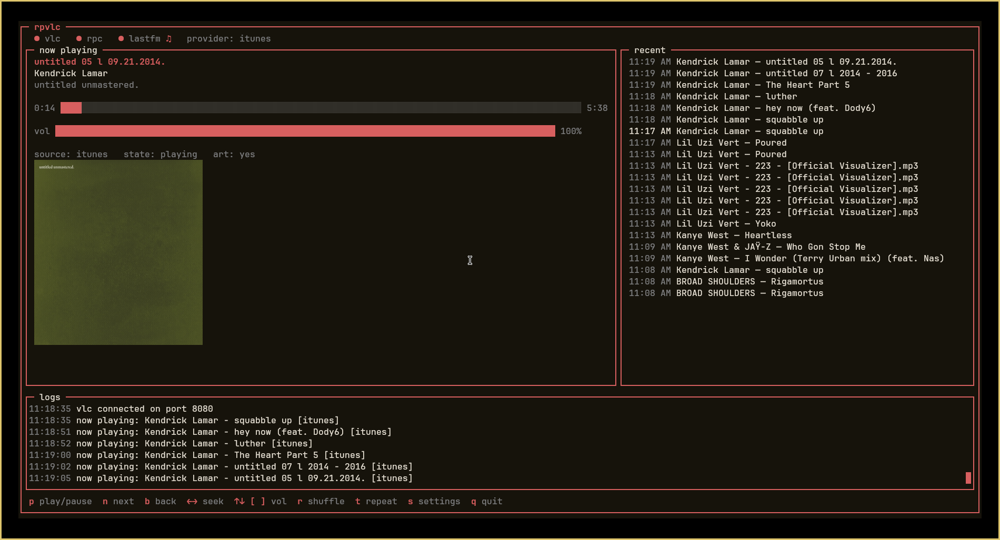

# rpvlc

discord rich presence for vlc with a tui. works with any vlc version (2.x–3.x), any discord client (real discord, vesktop/vencord with arRPC), on windows, linux, and macos.



## features

- **discord rpc** — "listening to" activity with cover art, artist, album, and a live progress timer bar
- **auto-detects vlc** — finds a running instance or launches one for you with the http interface enabled
- **port scanning** — if vlc is running on a different port, rpvlc scans 8080–8090 to find it
- **metadata resolution** — local file tags first, then filename parsing, then provider lookup (itunes, deezer, musicbrainz)
- **smart matching** — title similarity + album/playlist hint + duration + multi-provider consensus to avoid AI covers and wrong matches
- **cover art cache** — downloads art to `~/.cache/rpvlc/art/` so discord never 404s on rotating provider urls
- **last.fm scrobbling** — connect your account, configurable thresholds (min duration, min listened, scrobble %)
- **tui** — now playing, progress bar, volume, recent tracks, live logs, settings overlay
- **headless mode** — `--headless` for running without the tui (just rpc)
- **desktop notifications** — optional track-change notifications via notify-send/osascript

## install

```bash
git clone https://github.com/realcgcristi/rpvlc.git
cd rpvlc
npm install
npm start
```

or globally:

```bash
npm install -g .
rpvlc
```

requires node 18+ and vlc with the http interface (rpvlc enables it automatically when launching vlc itself).

## usage

```
rpvlc [options]

options:
  --port <n>        vlc http port (default: from config or 8080)
  --password <s>    vlc http password (default: from config)
  --provider <p>    metadata provider: itunes, deezer, musicbrainz
  --no-rpc          disable discord rpc
  --headless        no tui, just rpc in the terminal
  --debug           verbose logging
  --version         print version
  --help            this message
```

## keybinds

| key | action |
|-----|--------|
| `p` / `space` | play/pause |
| `n` | next track |
| `b` | previous track |
| `←` / `→` | seek -10s / +10s |
| `↑` / `↓` / `[` / `]` | volume |
| `r` | toggle shuffle |
| `t` | toggle repeat |
| `s` | settings |
| `l` | launch vlc |
| `q` | quit |

## settings

press `s` in the tui. all changes save instantly to `~/.config/rpvlc/config.json`.

- **provider** — which metadata provider to prefer (itunes, deezer, musicbrainz)
- **local first** — prefer embedded file tags over provider lookup
- **art lookup** — search for cover art when none is embedded
- **notifications** — desktop notification on track change
- **accent** — tui color theme (mint, ocean, violet, ember, rose)
- **vlc password/port** — http interface credentials
- **discord client id** — your discord application id
- **lastfm** — connect, scrobble thresholds

## last.fm

1. create an api account at last.fm/api/account/create
2. in settings (`s`), enter your api key, api secret, username, password
3. select "lastfm connect" — rpvlc authenticates and stores the session key
4. scrobbling happens automatically based on your thresholds

default thresholds: min song duration 60s, scrobble after 60s listened or 50% of the song (whichever first). minimums per last.fm spec: 30s/30s/30%.

## how metadata works

1. **local tags** — if `local_first` is on and the file has embedded id3/vorbis tags, those win
2. **filename parsing** — detects `Artist - Title` vs `<playlist> - <NNN> <title>` structures
3. **provider lookup** — searches your preferred provider, scores candidates by:
   - title similarity (dominant signal)
   - album/playlist hint matching
   - artist matching
   - duration proximity (breaks ties between same-titled songs)
   - provider ranking (real songs rank above ai covers)
4. **multi-provider consensus** — for uncertain matches, a second provider is queried; both must agree on the artist
5. **art fallback** — if your preferred provider has no cover, the other two are tried

## config location

- linux/macos: `~/.config/rpvlc/config.json`
- windows: `%APPDATA%/rpvlc/config.json`

history: `~/.config/rpvlc/history.json`
art cache: `~/.cache/rpvlc/art/`

## run as a service (systemd)

```ini
# ~/.config/systemd/user/rpvlc.service
[Unit]
Description=rpvlc - discord rpc for vlc
After=graphical-session.target

[Service]
ExecStart=/usr/bin/node /path/to/rpvlc/src/index.js --headless
Restart=on-failure
RestartSec=5

[Install]
WantedBy=default.target
```

```bash
systemctl --user daemon-reload
systemctl --user enable --now rpvlc
```

## discord client id

rpvlc ships with a default client id. to use your own:

1. go to discord.com/developers/applications
2. create an application
3. copy the application id into settings → "discord client id"

## license

MIT